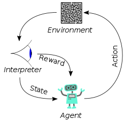

# The Learners Py 

**This is a beta project**

The Learners PY is a template of trainable bot to training agents to play [Lugo Bots](https://beta.lugobots.dev/).

This template runs only as an example, but it does not create a model.

Use this code as a quick start kit to create your model.

## Running this example

### Set the environment up
1. Initialize your venv `virtualenv venv --python=python3.9`
2. Activate your virtual environment `source venv/bin/activate`
3. Install the requirements `pip install -r requirements.txt`

### Initializing the trainning

#### 1st Step: Start the Game Server

The Game Server must be initialized with the flags `--dev-mode --timer-mode=remote` to allow the game be fully controlled by the trainning session.

You may run the Game Server as a container:

```shell
docker run -p 8080:8080 -p 5000:5000 lugobots/server:latest play --dev-mode --timer-mode=remote
```

Or, you may [download the Game Server binaries at https://hub.docker.com/r/lugobots/server](https://hub.docker.com/r/lugobots/server) that will get a significantly higher performance:

```shell
# Executin the binary on Linux
./lugo_server play --dev-mode --timer-mode=remote
```

#### 2nd Step: (optional) Run another bot

**Note** The initial example is design to training with static bots. Run against another bot if your BotTrainer expected real players.

Run `docker compose -f docker-compose-away-team.yml up` to run against the official bot Level-1 (aka The Dummies Go)

##### 3rd Step: Start your trainning script
```shell
python main.py
```

## How to use the code

The training function was designed to be very similar to [OpenAI Gym training environments](https://gymnasium.farama.org/).
So, if you are here you probably know what you must do there.

As a Reinforcemente Learning playground, this environment work based on the cicle environment -> action -> reward.



### BotTrainer

Change the [Bot Trainer](./my_bot.py) to define your bot and environment behavour.

```python
import lugo4py

class BotTrainer:

    # (not seen at the picture above)
    # Sets up the initial game state (e.g. you may change the initial player positions, ball position, etc)
    # Important: must return the new lugo4py.GameSnapshot, not your environment state (sensors)
    def set_environment(self, data) -> lugo4py.GameSnapshot:
        pass

    # The "interprefer" at the picture above
    # Receives the game snapshot and returns the state of whatever you are training (e.g. coordinates of an element, opponents distance, etc) 
    def get_state(self, snapshot: lugo4py.GameSnapshot):
        pass
    
    # The "interprefer" at the picture above
    # Receives the previous and the new snapshot and should return the evaluation/result. 
    # Note that this method returns `Any`. Depending on what framework/algorithm you use, you may return `{reward, done}` or something
    # else.
    def evaluate(self, previous_snapshot: lugo4py.GameSnapshot, new_snapshot: lugo4py.GameSnapshot) -> Any:
        pass
    
    # The "agent" at the picture above, but instead of chosing an action, executes it on the environment (game)
    # Receives the game snapshot and the action chosen by your Reinforcement Learning framework/algorithm and executes the Lubo bot orders that 
    # the action represents (e.g. move forward, kick, etc)
    def play(self, order_set: lugo4py.OrderSet, snapshot: lugo4py.GameSnapshot, action) -> lugo4py.OrderSet:
        pass

```
### Training function

Change the `training` function on [training_function.py](./training_function.py) file to create your model.

The training function receives a `TrainingController`, that you allow you to communicate your TrainableBot with your model.

```python
import lugo4py

class TrainingController:
    #
    # This method should be called whenever your need to reset the game to an initial state.
    # The 
    @abstractmethod
    def set_environment(self, data) -> lugo4py.GameSnapshot:
        pass

    #
    # Use this method to get the inputs that will be used by your BotTrainer when BotTrainer.set_environment is called 
    #
    @abstractmethod
    def get_state(self):
        pass

    #
    # Use this method to pass that action picked by you model. It will return the reward and `done` values got from
    # your BotTrainer.
    # @param action
    # @returns {Promise<{reward: number, done: boolean}>}
    #
    @abstractmethod
    def update(self, action):
        pass

    #
    # Stops the training
    #

    @abstractmethod
    def stop(self):
        pass
```


## After training your model

This code is only meant to training your model, it won't build a final bot.


When your model is ready to play, create a bot using the bot template ([The dummies](https://github.com/lugobots/the-dummies-py)) and use the model
to help your bot takes its decisions.
